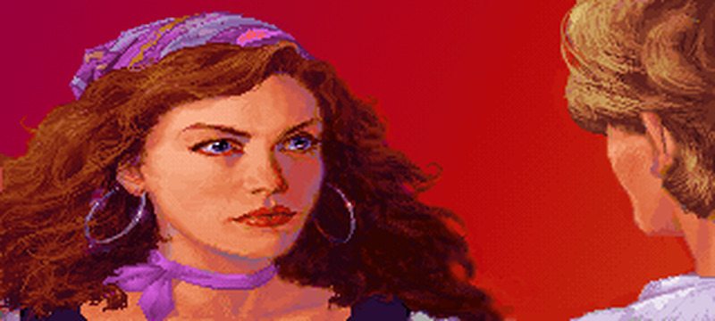
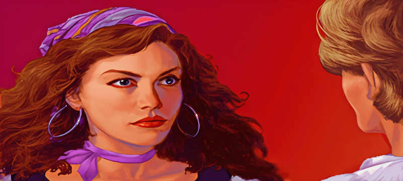
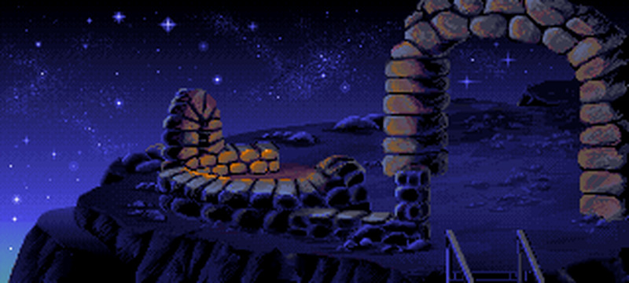
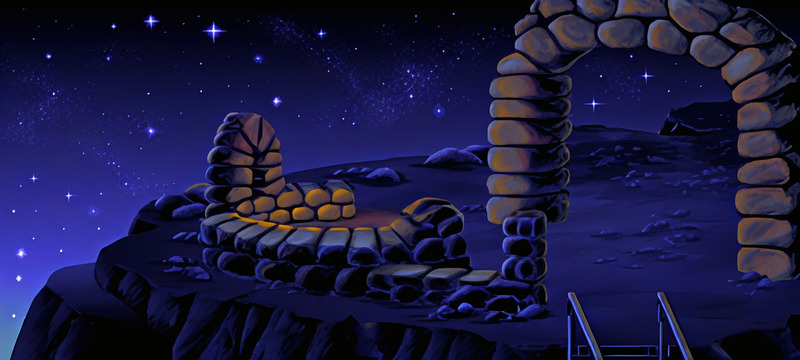
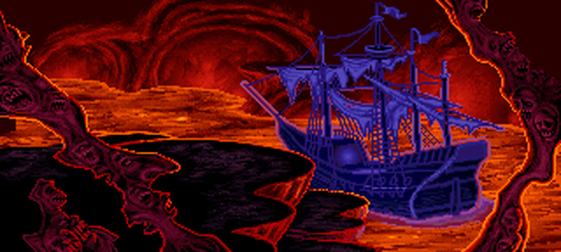
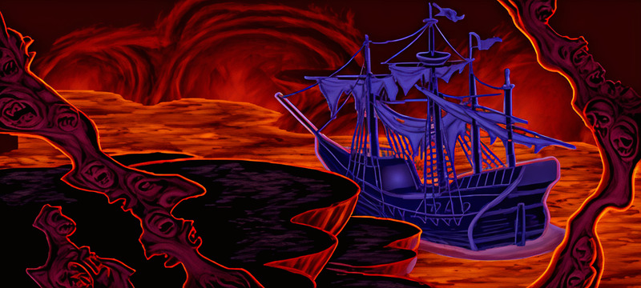
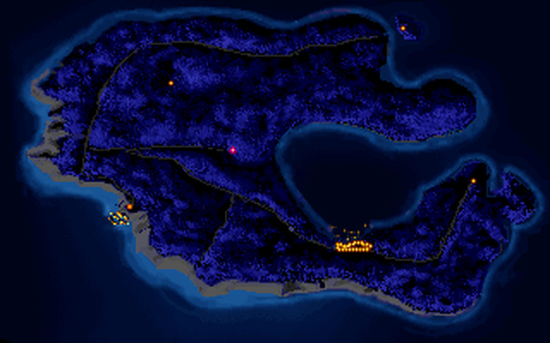
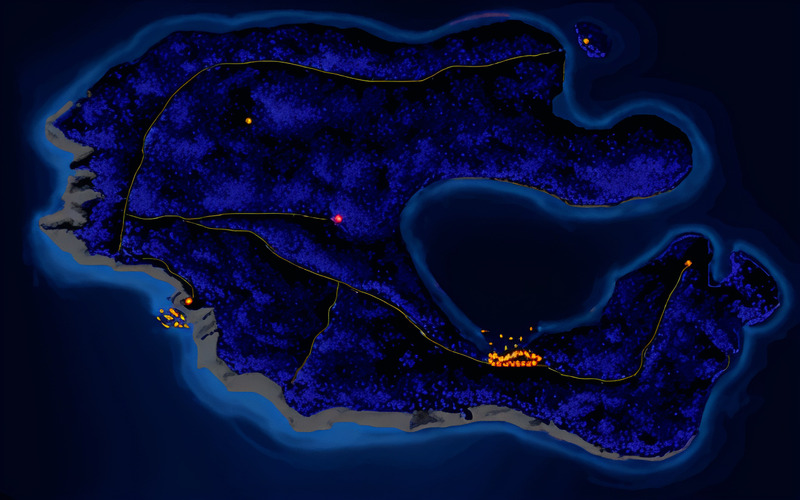

# Monkey Island SVGA

`Monkey Island SVGA` es un fork especializado de ScummVM pensado para disfrutar de **The Secret of Monkey Island VGA CD para PC** con un tratamiento gráfico en alta definición.

La idea es simple: mantener intacto el juego que conocemos y queremos, pero darle una presentación visual mucho más rica gracias a fondos, objetos y mejoras de render específicas para esta edición.

## Comparativa visual

Así se ve el salto entre una imagen original ampliada por interpolación y su equivalente HD dentro de este proyecto:

| Baja resolución interpolada | Versión HD |
| --- | --- |
|  |  |
|  |  |
|  |  |
|  |  |

La idea no es “estirar” Monkey Island, sino reconstruir su presentación visual con assets preparados específicamente para esta edición.

## Qué es este proyecto

Este fork añade una ruta de render propia para Monkey Island 1 VGA CD en PC, con soporte para:

- fondos HD a `4x`
- objetos HD a `4x`
- composición final en `RGBA`
- mejora en tiempo real de sprites dinámicos mediante `xBRZ`
- inventario con PNGs HD
- shaders CRT ajustados para esta variante

No pretende ser una distribución genérica de ScummVM. Está enfocado en un único objetivo: **Monkey Island 1 VGA CD para PC en versión SVGA/HD**.

## Qué versiones cubre

Este fork está orientado a:

- **The Secret of Monkey Island CD para DOS/PC**
- la edición VGA basada en SCUMM v5 con variante detectada como `CD`
- copias compatibles con esa misma ROM base

Quedan fuera del objetivo del proyecto:

- otras ediciones VGA de PC que no compartan la variante `CD`
- Monkey Island 2
- versiones EGA
- variantes de otras plataformas como FM-Towns, Amiga, Mac o Sega CD

## Base del proyecto

Este proyecto está **basado en ScummVM**.

ScummVM sigue siendo el motor base, la referencia técnica principal y el proyecto upstream al que se debe este trabajo. Este fork simplemente adapta y especializa ScummVM para ejecutar Monkey Island 1 VGA con assets HD y un pipeline gráfico propio.

En pocas palabras:

**Monkey Island SVGA, impulsado por ScummVM**

## Qué se distribuye

Este proyecto **no distribuye el juego original**.

Necesitas tu propia copia legal de **The Secret of Monkey Island CD para PC**.

Lo que sí forma parte de este proyecto es:

- el código fuente del fork
- los cambios sobre ScummVM
- los shaders específicos de esta edición
- los assets HD generados para esta versión

## Qué hace distinto a este fork

- Overlay de assets externos `Monkey_4X`
- soporte para fondos HD en `PNG` y `JPEG`
- soporte para objetos HD en `PNG`
- inventario con sustitución directa por PNGs HD
- render específico `MonkeyHdRenderer`
- mejora runtime de sprites clásicos con `xBRZ`
- conjunto de shaders reducido a los presets CRT realmente soportados por este fork
- arranque directo de Monkey Island sin pasar por el launcher
- validación estricta de la ROM: sólo acepta la edición `CD/DOS`

## Compilación

La compilación recomendada queda restringida al engine `SCUMM`:

```bash
./configure --disable-all-engines --enable-engine=scumm
make -j8 scummvm
```

Si existe el script auxiliar, hace exactamente eso:

```bash
./build-monkey.sh
```

La intención es que cualquiera pueda compilar este fork en su sistema, siempre que ScummVM sea compilable en esa plataforma y existan las dependencias habituales.

## Arranque

El ejecutable está pensado para comportarse como una app dedicada a este juego:

- si se lanza sin argumentos, intenta arrancar directamente `The Secret of Monkey Island (CD/DOS)` desde el directorio donde está el binario
- si encuentra una ROM distinta, o no encuentra la ROM correcta, aborta con error
- en ese arranque directo activa subtítulos por defecto
- en ese arranque directo arranca a pantalla completa por defecto
- el shader por defecto en ese arranque directo es `CRT Interlaced Halation Extreme`

En otras palabras: no hay que elegir juego en el launcher. Si la carpeta contiene la ROM correcta y `Monkey_4X`, arranca.

## Estructura esperada

El ejecutable debe convivir con los datos del juego y con los assets HD.

Ejemplo típico:

```text
Monkey/
  scummvm
  scummvm-local.ini
  MONKEY.000
  MONKEY.001
  monkey.sog
  Monkey_4X/
    backgrounds/
    objects/
  gui/
    themes/
```

En una distribución dedicada, ese ejecutable puede renombrarse sin problema, por ejemplo a `MonkeySVGA`. Lo importante no es el nombre del binario, sino que conviva con la ROM correcta y con `Monkey_4X`.

Notas:

- `Monkey_4X/backgrounds` puede usar `.png`, `.jpg` o `.jpeg`
- `Monkey_4X/objects` usa `.png`
- `Monkey_extracted` puede existir como material de trabajo para generar assets, pero ya no es una dependencia de runtime
- los ficheros mínimos de la ROM base son `MONKEY.000` y `MONKEY.001`
- el juego original no se incluye
- los assets HD sí forman parte del proyecto

## Shaders

Este fork sólo mantiene los shaders CRT preparados para esta versión:

- `crt-interlaced-halation-monkeyhd.glslp`
- `crt-interlaced-halation-strong-monkeyhd.glslp`
- `crt-interlaced-halation-extreme-monkeyhd.glslp`

No se pretende dar soporte a presets genéricos de ScummVM que no estén pensados para esta resolución y este pipeline.

## Legal

Este repositorio no incluye los datos originales de LucasArts.

Debes aportar tu propia copia del juego original.

Los assets HD incluidos en este proyecto pertenecen a esta adaptación y se distribuyen como parte del fork, pero no sustituyen la necesidad de poseer el juego original.

ScummVM se distribuye bajo GPL. Consulta [COPYING](COPYING), [COPYRIGHT](COPYRIGHT) y [AUTHORS](AUTHORS) para los detalles de licencia y atribución.

## Upstream

Proyecto original:

- [ScummVM en GitHub](https://github.com/scummvm/scummvm)
- [Web oficial de ScummVM](https://www.scummvm.org/)

Este fork nace desde ahí, con mucho respeto al proyecto original y con una intención muy concreta: darle a Monkey Island 1 VGA una versión HD bonita, coherente y fácil de compilar.
